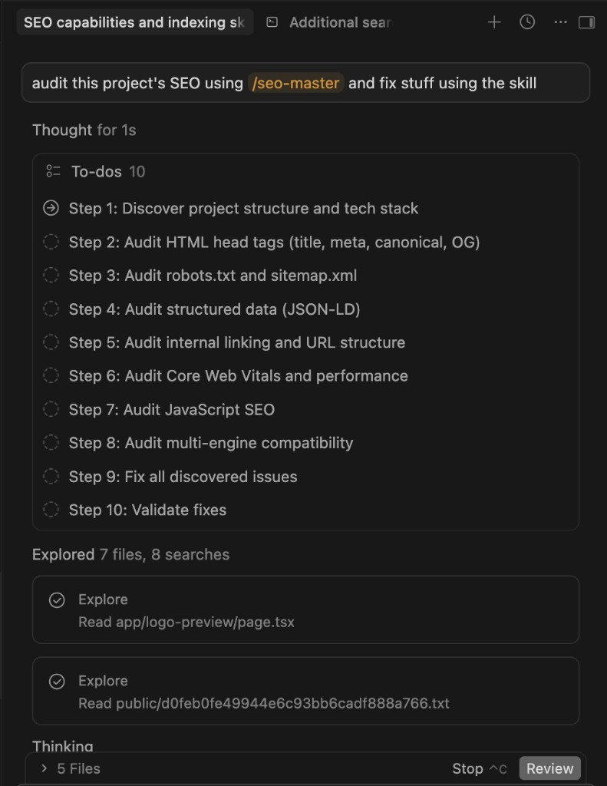
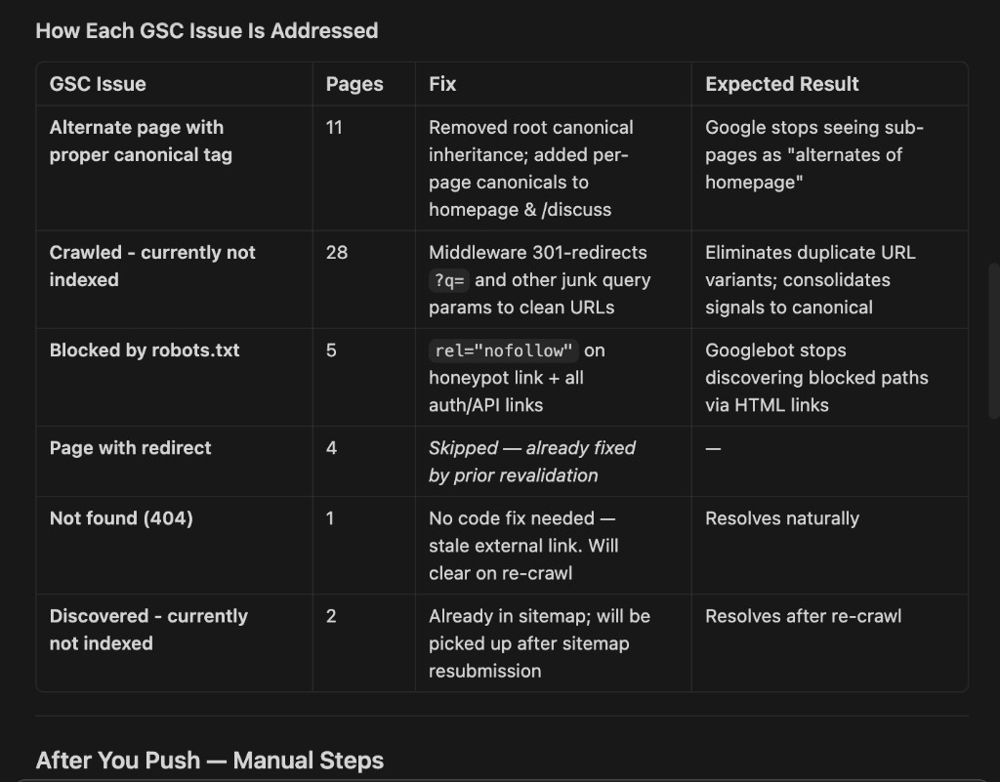
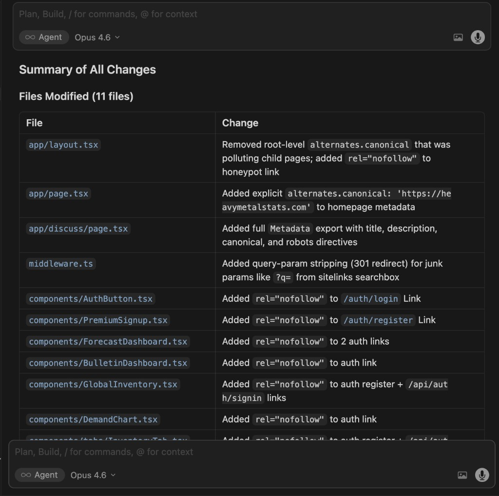
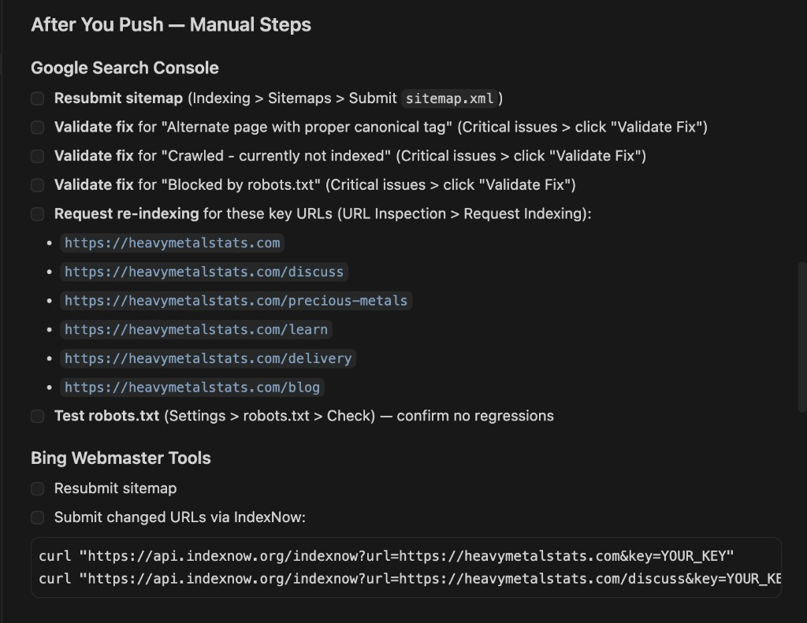

# SEO Master — Cursor and Claude Skill for Web Developers

An AI-powered SEO auditing, CTR optimization, and indexing error resolution skill for [Cursor](https://cursor.com). Drop it into your project and let your AI coding assistant handle technical SEO across **Google, Bing/Copilot, Yandex, Apple, Baidu, Naver, and Seznam.cz** — so you can focus on building.

## What This Is

SEO Master is a **Cursor Agent Skill** — a set of structured markdown files that give Cursor's AI agent deep domain knowledge about search engine optimization. When attached to a conversation, the agent can audit your codebase, identify SEO issues, and fix them directly in your source files.

Think of it as giving your AI assistant the equivalent of a senior SEO engineer's knowledge base, covering every major search engine's documentation.

## What It Does

When you trigger the skill (mention SEO, indexing errors, search rankings, sitemaps, etc.), the agent follows a **11-step audit workflow**:

1. **Discovers your tech stack** — Static HTML, Next.js, Nuxt, SvelteKit, Astro, React SPA, WordPress, etc.
2. **Audits HTML head tags** — title, meta description, canonical URLs, Open Graph, Twitter Cards
3. **Optimizes click-through rate (CTR)** — analyzes GSC data, rewrites titles/descriptions for higher CTR, adds dynamic dates for time-sensitive queries, fixes www/non-www duplication, recommends rich snippets
4. **Audits robots.txt and sitemaps** — validates structure, checks for blocking issues, verifies IndexNow setup
4. **Audits structured data** — JSON-LD schema.org markup for rich results (Articles, Products, FAQs, Events, etc.)
6. **Audits internal linking and URL structure** — anchor text, hierarchy depth, orphan pages
7. **Audits Core Web Vitals** — LCP, INP, CLS with specific fix recommendations
8. **Audits JavaScript SEO** — SSR/SSG verification, client-side rendering detection
9. **Audits multi-engine compatibility** — engine-specific directive differences, AI grounding controls, regional requirements
10. **Fixes issues** in priority order — Critical > High > Medium > Low
11. **Validates fixes** across all engines and provides post-deploy manual steps

The agent doesn't just tell you what's wrong — it edits your code to fix it, then tells you what manual steps remain (like submitting sitemaps in Google Search Console).

## Search Engine Coverage

| Engine | Coverage |
|--------|----------|
| **Google** | Full — GSC indexing errors (22 types), crawl/render/index pipeline, structured data, Core Web Vitals |
| **Bing / Copilot** | Full — 22 webmaster guidelines, AI grounding directives, GEO (Generative Engine Optimization), `data-nosnippet`/`data-snippet` controls |
| **Yandex** | Full — 25-type error taxonomy, Original Texts tool, `keywords` meta tag handling, Host directive, 10MB limits |
| **Apple (Applebot)** | Covered — Applebot vs Applebot-Extended, Googlebot fallback behavior, Siri/Spotlight/Safari optimization |
| **Baidu** | Covered — ICP License requirements, no-JS rendering, `noindex` not supported, mainland China hosting |
| **Naver** | Covered — Registration-first discovery, 14-day indexing, supported structured data types |
| **Seznam.cz** | Covered — SeznamBot behavior, server-rendered HTML preference, manual submission limits |
| **DuckDuckGo** | Covered via Bing (sources results from Bing index) |
| **IndexNow** | Full — cross-engine instant notification protocol (Bing, Yandex, Naver, Seznam, Yep) |

## File Structure

```
seo-master/
├── SKILL.md                 # Main skill — 11-step audit workflow and quick reference
├── bing-copilot-seo.md      # Bing's 22 guidelines, Copilot/AI grounding, GEO concepts
├── multi-engine-errors.md   # Indexing error types for Bing, Yandex, and Apple (alongside Google)
├── regional-engines.md      # Baidu, Naver, Seznam.cz technical requirements
├── indexing-errors.md       # Google Search Console — all 22 indexing error types with fixes
├── technical-seo.md         # Crawling, rendering, meta directives, multi-engine robots.txt
├── structured-data.md       # JSON-LD implementation for all schema.org types
├── audit-checklist.md       # Comprehensive audit checklist (13 sections + monitoring)
└── README.md
```

## Installation

### For Cursor Users

Copy the `seo-master/` folder into your Cursor skills directory:

```bash
# Clone the repo
git clone https://github.com/kingkpink/SEOMaster.git

# Copy into your Cursor skills directory
cp -r SEOMaster/ ~/.cursor/skills/seo-master/
```

Then mention SEO in any Cursor conversation, or attach the skill manually with `/seo-master`.

### As a Reference

Even without Cursor, the markdown files serve as a standalone technical SEO reference. Each file is self-contained and covers its topic with actionable fix steps and code examples.

## Usage Examples

Once installed, just describe what you need in Cursor:

- *"Audit this site for SEO issues"* — Runs the full 11-step workflow
- *"My CTR is terrible, here's my GSC data"* — Analyzes CTR by position, rewrites titles/descriptions, recommends rich snippets
- *"Fix my Google Search Console indexing errors"* — Diagnoses and resolves specific GSC issues
- *"Add structured data to my product pages"* — Implements JSON-LD Product schema
- *"Set up robots.txt for all search engines"* — Generates a multi-engine robots.txt
- *"Optimize this Next.js app for Bing Copilot"* — Applies GEO best practices and AI grounding directives
- *"Make this site work for Baidu"* — Identifies China-specific blockers (JS rendering, ICP, hosting)

## How the skill flows in Cursor

The following screenshots walk through a real SEO audit in Cursor — from the first prompt through documentation, review, and post-deploy follow-up.

### 1. Planning and exploration

When you ask the agent to audit a project (for example with `/seo-master`), it breaks the work into **to-dos**, follows the **10-step workflow**, and **explores** your codebase before making edits.



### 2. Mapping fixes to issues

The agent documents what was wrong and what changed. Below is an example table tying **Google Search Console** issues to **fixes** and **expected results** (from a real project run).



### 3. Reviewing changes

Before you accept edits, the agent presents a **summary of all changes** across files so you can review what was modified in one place.



### 4. After you push

Code fixes are only part of the workflow; the agent also outlines **manual steps** after deployment (Search Console validation, sitemap resubmission, Bing / IndexNow, etc.).



## Key Highlights for Developers

**Engine-specific gotchas that break real projects:**

| Gotcha | Engine | What Happens If You Miss It |
|--------|--------|-----------------------------|
| `noindex` meta tag is ignored | Baidu | Pages you want hidden appear in Chinese search results |
| No JavaScript rendering | Baidu | Your entire SPA is invisible to 70% of China's search traffic |
| `noarchive` blocks AI answers | Bing | Content disappears from Copilot citations |
| Applebot falls back to Googlebot rules | Apple | Your Google-specific blocks accidentally hide you from Siri/Spotlight |
| Allow overrides Deny | Yandex | Pages you blocked are actually accessible to Yandex |
| `keywords` meta tag used for ranking | Yandex | Missing an easy ranking signal that other engines ignore |
| ICP License legally required | Baidu | Your site gets blocked by the Great Firewall |

**Multi-engine meta directive support:**

| Directive | Google | Bing | Yandex | Baidu | Apple |
|-----------|--------|------|--------|-------|-------|
| `noindex` | Yes | Yes | Yes | **No** | Yes |
| `noarchive` | Yes | Yes (blocks Copilot) | Yes | Yes | No |
| `nocache` | No | **Yes** (Copilot control) | No | No | No |
| `data-nosnippet` | Yes | Yes | No | No | No |
| `data-snippet` | No | **Yes** | No | No | No |

## Real-World Results

The following results come from deploying the SEO Master skill against a live Next.js site behind Cloudflare and Vercel in April 2026. The site had been live for over a month with minimal organic traction before the skill was used.

### What the Skill Found and Fixed

The skill ran its 10-step audit and identified **12 distinct issues** across the codebase, resolving all of them in a single session:

| # | Issue Found | Severity | What the Skill Did |
|---|------------|----------|-------------------|
| 1 | Middleware sending `X-Robots-Tag: noindex, nofollow` on all non-crawler requests | **Critical** | Narrowed `noindex` to only `/login` and `/api/*` — every other page was being told not to index |
| 2 | No canonical redirect between apex and www | **Critical** | Added 301 redirect in middleware (fixes 4 GSC redirect errors) |
| 3 | Sitemap `lastModified` hardcoded to a stale date | **High** | Made `lastModified` dynamic — crawlers now see fresh signals on every visit |
| 4 | JSON-LD `dateModified` frozen weeks behind actual content | **High** | Set to build-time timestamp so structured data reflects reality |
| 5 | No Google News eligibility signals | **High** | Added `NewsArticle` JSON-LD, `news_keywords` meta, switched OG type to `article` |
| 6 | No IndexNow integration | **High** | Built `/api/indexnow` endpoint + bulk submission script; submitted 34 URLs to Bing, Yandex, Seznam.cz |
| 7 | 5 pages missing canonical URLs | **High** | Added self-referencing canonicals to all affected pages |
| 8 | 6 archived evidence pages not in sitemap | **Medium** | Added all archive pages to sitemap with appropriate priority |
| 9 | Title/description lengths exceeding Bing's display limits | **Medium** | Trimmed all 30 page titles and descriptions to fit Bing's truncation thresholds |
| 10 | Crawlers receiving `no-store, no-cache` headers | **Medium** | Enabled `public, max-age=3600, s-maxage=86400` for crawler user-agents |
| 11 | BreadcrumbList JSON-LD incomplete | **Low** | Expanded from 7 to 9 items, adding two high-priority sections |
| 12 | No custom 404 page | **Low** | Added a branded 404 page to retain visitors on dead URLs |

### Traffic Impact

Within **48 hours** of deploying the skill's fixes:

- **12,000+ Cloudflare requests in a single day** — 2x the entire prior week's traffic combined
- **21,107 total requests** recorded in the Cloudflare reporting window
- **90.4% of traffic from the United States**, aligned with the site's target audience
- Multi-engine crawler activity confirmed from **6+ countries** matching known datacenter locations for Google (NL, DE, JP, IN), Yandex (RU), and Baidu (CN)

The spike was driven by three converging effects the skill's fixes triggered simultaneously:

1. **IndexNow blast** — 34 URLs submitted to 4 search engines at once, triggering an immediate crawl storm
2. **Redirect error resolution** — Google re-validated all previously errored URLs after the 301 fix
3. **Google News / Discover eligibility** — `NewsArticle` schema + `news_keywords` opened the door to Google's high-traffic news and discovery surfaces

### Before vs. After

| Metric | Before Skill | After Skill |
|--------|-------------|-------------|
| Pages with `noindex` signal on non-crawler requests | All pages | Only `/login` and `/api/*` |
| Sitemap freshness signal | Frozen (March 25) | Dynamic (updates daily) |
| JSON-LD `dateModified` | Frozen (March 5) | Build-time dynamic |
| Google News eligible | No | Yes (NewsArticle schema) |
| IndexNow configured | No | Yes (4 engines) |
| Canonical redirect (apex → www) | Missing | 301 redirect |
| Crawler cache headers | `no-store` | `public, max-age=3600` |
| Pages in sitemap | 28 | 34 |
| Single-day peak traffic | ~850 requests | 12,000+ requests |

---

## Block AI Scraping Without Losing AI Search Visibility

AI companies run two kinds of crawlers on your website, and most site owners don't realize they can be controlled independently:

- **Training crawlers** scrape your pages to feed large language models. Your content becomes part of their training data — used to generate answers for other people, with no link back to you. This is the part that takes your intellectual property.
- **Search crawlers** index your pages so they appear in AI-powered search results (ChatGPT Search, Perplexity, Google AI Overviews, Bing Copilot). When a user searches, your page shows up with a citation and a link back to your site. This is the part that drives traffic.

Most AI companies now separate these into distinct bots with different user-agent strings. That means **you can block training while staying indexed in their search products** — through `robots.txt` alone.

### How the split works

| Company | Search bot (allow) | Training bot (block) |
|---------|-------------------|---------------------|
| **Google** | `Googlebot` — indexes for Search + AI Overviews | `Google-Extended` — feeds Gemini training |
| **OpenAI** | `OAI-SearchBot` — powers ChatGPT Search results | `GPTBot` — collects training data |
| **Apple** | `Applebot` — powers Siri, Spotlight, Safari | `Applebot-Extended` — feeds Apple Intelligence |
| **Bing** | `Bingbot` — indexes for Bing Search + Copilot | *(no separate training bot — use meta directives)* |
| **Anthropic** | *(no search product)* | `ClaudeBot` / `anthropic-ai` — training only |
| **Meta** | *(no search product)* | `meta-externalagent` — Llama training |
| **Perplexity** | `PerplexityBot` — AI search, cites sources | *(same bot, search-only)* |

### What this looks like in robots.txt

```
# Let search engines and AI search bots index your site
User-agent: Googlebot
Allow: /

User-agent: Bingbot
Allow: /

User-agent: OAI-SearchBot
Allow: /

User-agent: PerplexityBot
Allow: /

User-agent: Applebot
Allow: /

# Block AI training crawlers — they take content, give nothing back
User-agent: GPTBot
Disallow: /

User-agent: Google-Extended
Disallow: /

User-agent: ClaudeBot
Disallow: /

User-agent: anthropic-ai
Disallow: /

User-agent: CCBot
Disallow: /

User-agent: Applebot-Extended
Disallow: /

User-agent: meta-externalagent
Disallow: /

User-agent: Bytespider
Disallow: /

User-agent: Amazonbot
Disallow: /

User-agent: cohere-ai
Disallow: /
```

The skill includes a complete reference with **25+ bots**, Next.js implementation examples, and verification steps in [technical-seo.md](technical-seo.md#ai-crawler-management-training-vs-search).

### Why this matters

Without these blocks, every AI training crawler that visits your site is free to ingest your content and use it to train models that compete with you. The models then generate answers derived from your work — without attribution, without a link, and without compensation. Blocking training bots is the minimum step to protect what you've built while still benefiting from AI-powered search traffic.

---

## Why SEO Matters

If you're building a website — whether it's a business, a project, a publication, or anything meant to be found — SEO is not optional. It is the single largest driver of website traffic, and ignoring it means your content is functionally invisible.

### Organic Search Dominates All Traffic Sources

**53% of all website traffic** comes from organic search, making it the largest single traffic channel by a wide margin. For B2B websites, that number climbs to **64%**. By comparison, paid search accounts for 15%, social media for 5%, and direct traffic for 22%.

> *Source: BrightEdge (2025). "AI Search Visits Surging in 2025 — But Organic Search Remains the Cornerstone of Digital Growth." [brightedge.com/resources/research-reports](https://www.brightedge.com/resources/research-reports/ai-search-visits-in-surging-2025)*

**68% of all online experiences begin with a search engine.** If your site isn't indexed and ranking, the majority of your potential audience will never know you exist.

> *Source: BrightEdge Channel Performance Report. Referenced in SearchLab, "SEO Statistics 2026." [searchlab.nl/en/statistics/seo-statistics-2026](https://searchlab.nl/en/statistics/seo-statistics-2026)*

### Technical Errors Silently Kill Traffic

**35% of websites** have critical technical issues that prevent proper crawling or indexing. Fixing these errors increases organic traffic by **20–35% on average** within 3–6 months. Pages with unresolved technical SEO problems rank **40–60% lower** than technically clean equivalents.

> *Source: RankTracker (2025). "Technical SEO Statistics — Complete Guide for 2025." [ranktracker.com/blog/technical-seo-statistics-2025](https://ranktracker.com/blog/technical-seo-statistics-2025/)*

**Only 37% of pages** across the web are fully indexed by Google. The other 63% exist but are invisible to search. Getting your pages into that 37% is what technical SEO does.

> *Source: IndexCheckr (2025). "Google Indexing Study: Insights from 16 Million Pages." [indexcheckr.com/resources/google-indexing](https://indexcheckr.com/resources/google-indexing)*

### SEO Has the Highest ROI of Any Marketing Channel

Well-executed SEO delivers a median ROI of **748%** ($7.48 returned per $1 invested). SEO leads close at a **14.6% rate**, compared to 1.7% for outbound marketing. The cost per acquisition through SEO averages **$14**, versus $38 for social media ads and $21 for email.

> *Source: SEOProfy (2026). "SEO ROI Statistics for 2026: Data, Benchmarks & Trends." [seoprofy.com/blog/seo-roi-statistics](https://seoprofy.com/blog/seo-roi-statistics)*

### Most Small Businesses Get This Wrong

**70% of small business websites** contain at least one critical SEO error that suppresses their Google rankings: missing structured data (61%), crawlability/indexing errors (49%), or page speed failures (64%). These aren't cosmetic issues — they directly prevent revenue.

> *Source: PRLog / Las Vegas SEO Study (2025). "7 in 10 Small Business Websites Have Critical SEO Errors." [prlog.org/13136352](https://www.prlog.org/13136352-las-vegas-seo-firm-finds-7-in-10-small-business-websites-have-critical-seo-errors-that-cost-them-rankings-and-revenue.html)*

### The Bottom Line

Your code can be perfect, your design beautiful, and your content invaluable — but if search engines can't find it, index it, and rank it, none of that matters. **SEO is the bridge between building something and having anyone actually see it.** Tools like this skill exist because the gap between "deployed" and "discoverable" is where most projects silently fail.

---

## Contributing

Found an error, or a search engine updated their docs? PRs welcome. Each file is self-contained — edit the relevant markdown file and submit.

## License

MIT
